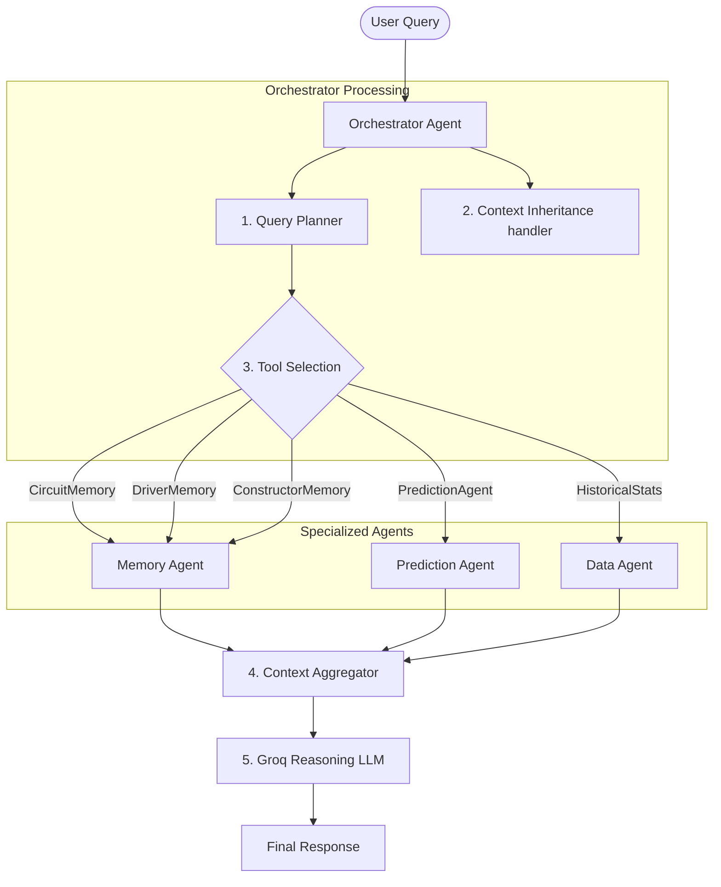
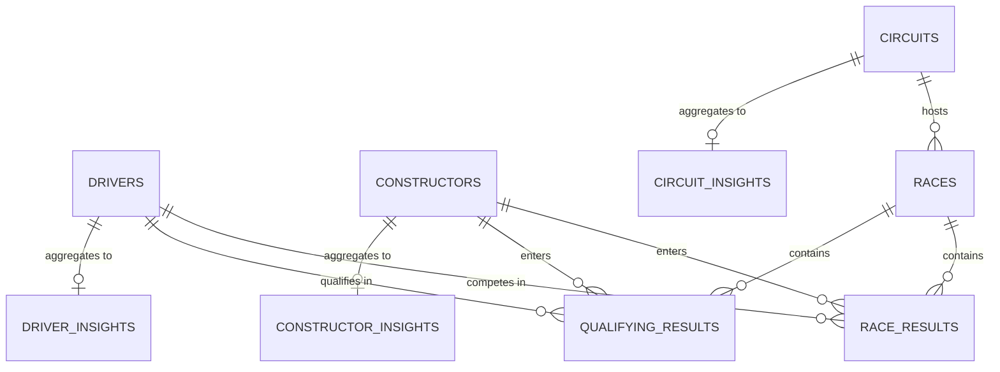

# Racecraft AI — Formula 1 Multi-Agent Intelligence Platform

Racecraft AI is a state-of-the-art Formula 1 command center and sports analytics platform. By combining historical race results, multi-season standings, constructor data, track-specific insights, and an advanced predictive machine learning engine, it delivers high-fidelity racing intelligence directly to the user.

What makes Racecraft AI different is its **Agentic Orchestrator Architecture**. Instead of routing user questions to a generic LLM, the platform decomposes queries, routes tasks to specialized domain agents, aggregates structured facts from a local SQLite database, and feeds the resulting telemetry to a reasoning LLM (Groq Llama 3.3) to output highly accurate, evidence-based responses.

---

## Tech Stack

### Frontend
- **Framework**: [React 19](https://react.dev/) (Vite-backed build environment)
- **Routing**: [React Router DOM v6](https://reactrouter.com/)
- **Styling**: [Tailwind CSS v3](https://tailwindcss.com/)
- **HTTP Client**: [Axios](https://axios-http.com/)

### Backend
- **Web Framework**: [FastAPI](https://fastapi.tiangolo.com/) (Python-based ASGI web server)
- **ASGI Server**: [Uvicorn](https://www.uvicorn.org/)
- **ORM**: [SQLAlchemy v2](https://www.sqlalchemy.org/)
- **Database**: [SQLite](https://sqlite.org/) (for localized testing and cache) / PostgreSQL compatibility via `psycopg2-binary`
- **Configuration**: `python-dotenv` & `Pydantic v2` settings validation
- **API Client**: `groq` (integration with high-throughput Llama-3.3-70b-versatile models)

### Data Engineering & ML
- **Telemetry & Schedule Cache**: [FastF1](https://github.com/theOehrly/Fast-F1) (extracting race sessions, telemetry, schedules, and qualifying times)
- **Data Analysis**: `Pandas` & `NumPy`
- **Predictive Engine**: `scikit-learn` (powering the composite scoring prediction model)

---

## Agent Architecture

Racecraft AI orchestrates four specialized sub-agents to serve user requests:



### Agents & Responsibilities
1. **Orchestrator Agent ([orchestrator_agent.py](file:///c:/Users/Prateek/Documents/Projects/F1-intelligent-agent/backend/app/agents/orchestrator_agent.py))**:
   - Analyzes questions to classify intent and select tools.
   - Handles **lightweight context inheritance** (traversing session history backwards to carry forward matched drivers, constructors, circuits, or prediction context).
   - Generates plans (e.g., `[CircuitMemory, DriverMemory, PredictionAgent]`).
   - Aggregates structured responses from selected sub-agents and queries Groq.
2. **Data Agent ([data_agent.py](file:///c:/Users/Prateek/Documents/Projects/F1-intelligent-agent/backend/app/agents/data_agent.py))**:
   - Downloads schedule, race results, and qualifying outcomes directly from FastF1.
   - Normalizes and persists records in the relational database.
3. **Memory Agent ([memory_agent.py](file:///c:/Users/Prateek/Documents/Projects/F1-intelligent-agent/backend/app/agents/memory_agent.py))**:
   - Rebuilds and updates driver, constructor, and circuit insights.
   - Calculates career aggregates (wins, podiums, points, average finishes) and serializes structured JSON performance profiles.
4. **Prediction Agent ([prediction_agent.py](file:///c:/Users/Prateek/Documents/Projects/F1-intelligent-agent/backend/app/agents/prediction_agent.py))**:
   - Implements a weighted model (40% Recent Form, 20% Track History, 20% Constructor Form, 10% Qualifying, 10% Championship standings).
   - Computes prediction confidence percentages and constructs detailed comparisons against closest challengers.
5. **Analyst Agent ([analyst_agent.py](file:///c:/Users/Prateek/Documents/Projects/F1-intelligent-agent/backend/app/agents/analyst_agent.py))**:
   - Formulates contextual system prompt rules for the reasoning phase.
   - Deduplicates sources and formats F1 insight responses.

---

## Database Schema & Relationships

The platform relies on the SQLite schema mapped below:



### Database Tables
- **`drivers`**: ID, code, first name, last name, nationality.
- **`constructors`**: ID, name, nationality.
- **`circuits`**: ID, name, location, country.
- **`races`**: ID, season, round number, name, date, circuit ID.
- **`race_results`**: ID, race ID, driver ID, constructor ID, grid position, finish position, points, status.
- **`qualifying_results`**: ID, race ID, driver ID, constructor ID, position, Q1/Q2/Q3 times.
- **`driver_insights`**: Driver ID, total races, total wins, total podiums, total points, average finish position, average qualifying position, recent form JSON, season breakdown JSON.
- **`constructor_insights`**: Constructor ID, total races, total wins, total podiums, total points, average points per race, season breakdown JSON.
- **`circuit_insights`**: Circuit ID, best drivers JSON (win rates, podium rates, avg finishes), best constructors JSON.

---

## Directory Structure

```text
racecraft-ai/
├── backend/
│   ├── app/
│   │   ├── agents/         # Intelligence agents (orchestrator, memory, prediction, data, analyst)
│   │   ├── api/            # API Route registration & routers (orchestrator, prediction, memory, system)
│   │   ├── core/           # Configuration settings validator
│   │   ├── database/       # SQLAlchemy engine & session builders
│   │   ├── models/         # SQLAlchemy ORM models (driver, constructor, circuit, race, memory)
│   │   ├── schemas/        # Pydantic request/response validators
│   │   └── main.py         # FastAPI application bootstrap
│   ├── scripts/            # Database import, migration, and smoke-testing utilities
│   ├── tests/              # Pytest unit & integration test suites
│   ├── requirements.txt    # Backend package dependencies
│   └── racecraft_ai.db     # SQLite database containing 2018-present F1 statistics
├── frontend/
│   ├── src/
│   │   ├── components/     # AppLayout, SeasonSelector, GlassCard
│   │   ├── lib/            # Axios API wrappers (f1Api.js, api.js, format.js)
│   │   ├── pages/          # DashboardPage, DriversPage, ConstructorsPage, RacesPage, AnalystPage, Detail pages
│   │   ├── App.jsx         # Client-side router declarations
│   │   ├── index.css       # Tailwind CSS & theme definitions
│   │   └── main.jsx        # React DOM entrypoint
│   ├── index.html          # Shell template with HTML tags and titles
│   ├── package.json        # Frontend NPM script definitions
│   └── vite.config.js      # Vite compilation configurations
└── README.md               # Documentation root
```

---

## Frontend Views

- **Dashboard ([DashboardPage.jsx](file:///c:/Users/Prateek/Documents/Projects/F1-intelligent-agent/frontend/src/pages/DashboardPage.jsx))**: Command center header, KPI tiles, side-by-side Completed/Upcoming race widgets, standings previews (driver & constructor tables), and ML prediction factor tables.
- **Drivers ([DriversPage.jsx](file:///c:/Users/Prateek/Documents/Projects/F1-intelligent-agent/frontend/src/pages/DriversPage.jsx)) & Detail ([DriverDetailPage.jsx](file:///c:/Users/Prateek/Documents/Projects/F1-intelligent-agent/frontend/src/pages/DriverDetailPage.jsx))**: Multi-season standings lists, aggregate stats panels, and recent rounds finishing charts.
- **Constructors ([ConstructorsPage.jsx](file:///c:/Users/Prateek/Documents/Projects/F1-intelligent-agent/frontend/src/pages/ConstructorsPage.jsx))**: Clean standings tables and team championship historical comparisons.
- **Races ([RacesPage.jsx](file:///c:/Users/Prateek/Documents/Projects/F1-intelligent-agent/frontend/src/pages/RacesPage.jsx)) & Detail ([RaceDetailPage.jsx](file:///c:/Users/Prateek/Documents/Projects/F1-intelligent-agent/frontend/src/pages/RaceDetailPage.jsx))**: Schedules and dynamic predict panels executing predictions directly from the ML engine.
- **AI Analyst ([AnalystPage.jsx](file:///c:/Users/Prateek/Documents/Projects/F1-intelligent-agent/frontend/src/pages/AnalystPage.jsx))**: ChatGPT/Perplexity-style full-height conversation view supporting Markdown, data cards, and citations.

---

## Setup & Installation

### Backend Setup
1. **Navigate to the backend directory**:
   ```bash
   cd backend
   ```
2. **Create a virtual environment and activate it**:
   ```bash
   python -m venv myenv
   myenv\Scripts\activate      # On Windows
   source myenv/bin/activate   # On Linux/macOS
   ```
3. **Install dependencies**:
   ```bash
   pip install -r requirements.txt
   ```
4. **Create a `.env` file** in the `backend/` directory:
   ```env
   GROQ_API_KEY=your_groq_api_key_here
   DATABASE_URL=sqlite:///c:/path/to/your/backend/racecraft_ai.db
   ```
5. **Populate database** (imports seasons 2018–2026):
   ```bash
   python scripts/import_historical_data.py
   ```
6. **Launch backend server**:
   ```bash
   uvicorn app.main:app --reload --port 8000
   ```

### Frontend Setup
1. **Navigate to the frontend directory**:
   ```bash
   cd frontend
   ```
2. **Install node packages**:
   ```bash
   npm install
   ```
3. **Run local developer server**:
   ```bash
   npm run dev
   ```
4. Open [http://localhost:5173/](http://localhost:5173/) in your web browser.

---

## Running Tests
Verify backend functionality using the pytest suite:
```bash
cd backend
pytest
```

---

## Example Questions the AI Can Answer

- **Circuit Dominance**: *"Who performs best at Monaco?"* or *"Which team dominantes Silverstone?"*
- **Stats Comparison**: *"Compare Hamilton and Verstappen career stats"* or *"Compare Leclerc and Norris career stats"*
- **Career Summaries**: *"Show Verstappen career summary"*
- **ML Predictions**: *"Predict Monaco GP"* or *"Predict the podium for Silverstone"*
- **Follow-up Context**:
  - User: *"Compare Hamilton and Verstappen"*
  - User: *"What about Silverstone?"* (inherits the driver context and runs circuit-specific driver metrics)
  - User: *"Predict Monaco GP"* &rarr; User: *"Why?"* (inherits last predicted GP context and prints factors considered)

---

## Future Roadmap
- [ ] Interactive telemetry lap charts.
- [ ] Real-time WebSocket feed integrations during Grand Prix weekends.
- [ ] Live pit stop optimization recommendations and strategy simulators.
- [ ] Driver and constructor valuation indices based on market telemetry.